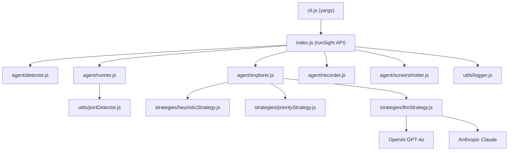

# Architecture

## Overview

RunSight is a modular autonomous agent that detects, runs, and explores web projects.

## Modules

| Module | Path | Responsibility |
|--------|------|----------------|
| CLI | `cli.js` | Parse arguments, invoke API |
| API | `index.js` | Orchestrate full pipeline |
| Detector | `agent/detector.js` | Identify project types and run commands |
| Runner | `agent/runner.js` | Install deps, start servers, manage processes |
| Explorer | `agent/explorer.js` | Drive browser with 3-tier strategy |
| Screenshotter | `agent/screenshotter.js` | Capture full-page screenshots |
| Recorder | `agent/recorder.js` | Record session video via Playwright |
| Logger | `utils/logger.js` | Dual output: logs.txt + report.json. Tracks steps, errors, screenshots. |
| Port Detector | `utils/portDetector.js` | Parse ports from stdout, TCP polling |
| Heuristic | `strategies/heuristicStrategy.js` | DOM-order element discovery + action execution |
| Priority | `strategies/priorityStrategy.js` | Score-based element ordering |
| LLM | `strategies/llmStrategy.js` | Vision LLM-guided action selection |

## Data Flow

1. **Detect** → Scan project directory for markers (`package.json`, `requirements.txt`, `index.html`)
2. **Run** → Install dependencies, start dev servers, detect ports
3. **Explore** → Launch browser, navigate to frontend URL, execute 3-tier exploration loop
4. **Capture** → Screenshot at each step, record video for full session
5. **Report** → Save `logs.txt` (human) + `report.json` (machine) + screenshots + video

## Exploration Strategy Tiers

### Tier 1: Heuristic (Base)
- Finds all interactable DOM elements (links, buttons, inputs, selects)
- Filters by visibility, size, enabled state
- Executes actions in DOM order with dummy data for inputs

### Tier 2: Priority-based (Scoring)
- Scores elements by semantic importance (nav links > primary buttons > inputs > secondary)
- Tracks visited URLs and clicked elements to avoid repeats
- Above-the-fold elements get bonus score

### Tier 3: LLM-guided (Vision)
- Sends screenshot + element list to GPT-4o or Claude
- LLM decides which element to interact with next and why
- Falls back to priority tier on API failure
